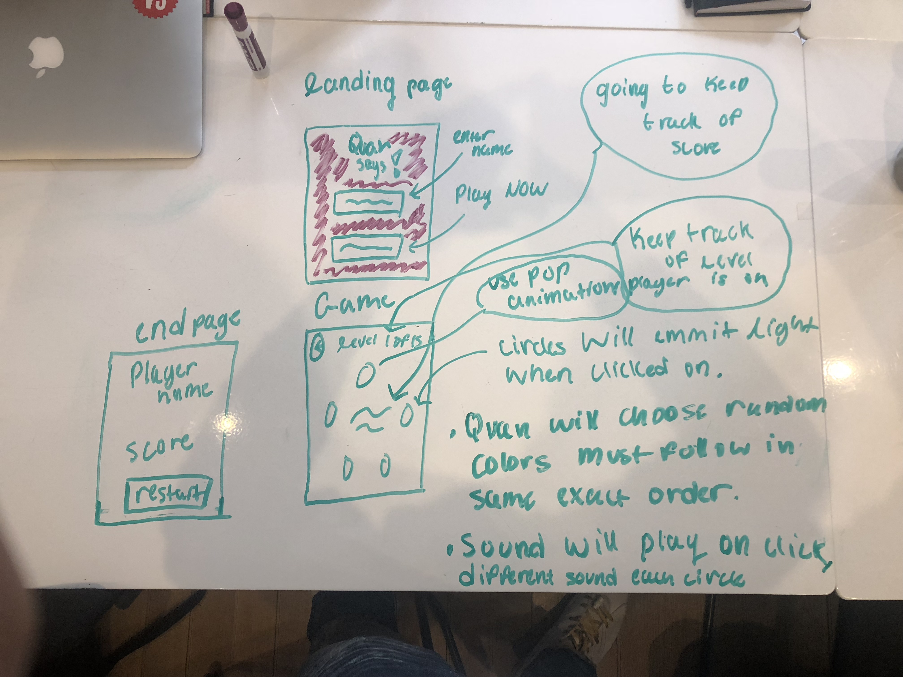
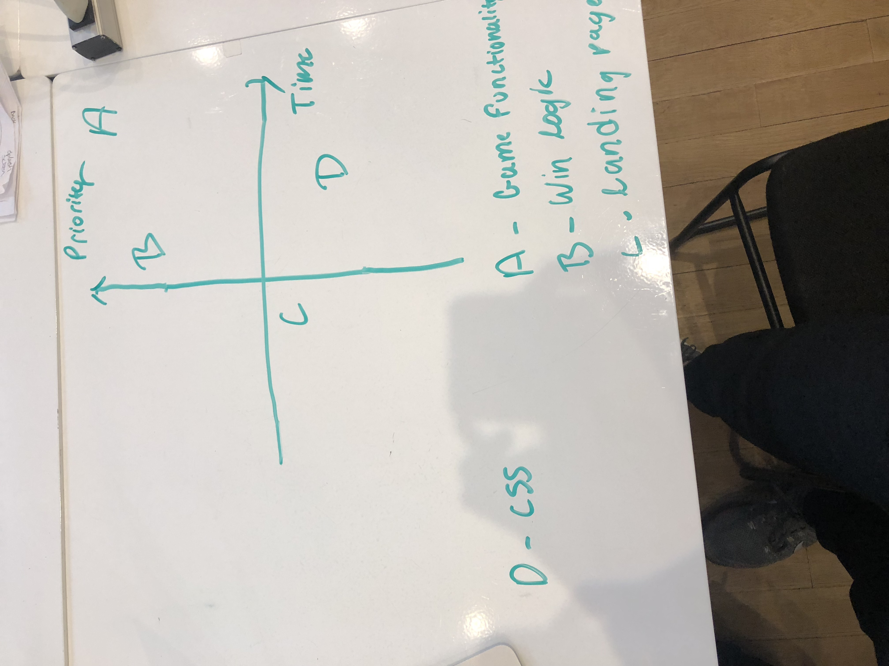

# Project Overview

## Project Schedule

This schedule will be used to keep track of your progress throughout the week and align with our expectations.  

|  Day | Deliverable | 
|---|---| 
|Day 1: Tue| Wireframes and Priority Matrix|
|Day 2: Wed| Project Approval /  Pseudocode / actual code|
|Day 3: Thur| Basic Clickable Model |
|Day 4: Fri| Working Prototype |
|Day 5: Sat| Final Working Project |
|Day 6: Sun| Bugs / Stylying / PostMVP |
|Day 7: Mon| Project Presentations |

## Project Description

<!-- Use this section to describe your final project and perhaps any links to relevant sites that help convey the concept and\or functionality. -->
The objecive of simon says is to follow the sequence the ins same exact order as the computer, in orer to move into the next round. For example, if the computer chooses red, blue, green, and green. You have to click in the those colors in the same exact sequence. As You continuewith the game , the difficulty increases and the computer will speed up!

## Wireframes

<!-- Include images of your wireframes.  -->

## Priority Matrix

<!-- Include a full list of features that have been prioritized based on the `Time and Importance` Matix.   -->

<!-- ## Game Components -->

### Landing Page
<!-- What will a player see when they start your game? -->
The player will load up the the page and he will see the starting screen with the tittle of the game. Below the title of the game, bax where he can enter his name and next to the that box will be a start button which will allow the player to start the game and move onto the game screen.

### Game Initialization
<!-- What will a player see when the game is started? 
 -->
 The top left corner he will see his score that will be kept throughout the game. The top right of the screen the player will see the name he entered on the previous screeen. In the center of the sreen will be the game the player will actually get to interact with. There will be 4 different colored circles that the user gets to click on and follow the computers sequence.
### Playing The Game
<!-- What will be the flow of the game, what will the user be expeted to do and what will the user expect from the game --> The user is expected to follow the computer sequence. The computer will click on random colored circles, the user will see the circles glow up in a sequence and once the computer is done. It will be the users turn,the user will be expected to folloe the same exact sequence as the computer did to advanced to the next level. There will be 15 levels ad the difficulty will increase as you advance in the game!

### Winning The Game
<!-- What does it look like when the game ends, what determines winning or losing? -->
IF the user won, In the midde of the screen, it will say, "congratulations you won!" and the highscore , if they user loses it will say, "Sorry you lost start again!".

### Game Reset
<!-- How will the user restart the game once it has been completed.
 -->
 There will be a restart button at the bottom of the screen the user will click on after they lose or win!
## MVP 

<!-- Include the full list of features that will be part of your MVP 
 -->
 <ul>
    <li>I want the game to work first of all.</li>
    <li>Get all the functions to work. </li>
    <li>I want the highscore to keep udpating each level.</li>
    <li>Get the diffculty to increase and the speed to increase the suer advances.</li>
    <li>Make sure it has all fucntional buttons inclduing the game pieces.</li>
    <li>I want a box to pop up when the game is over with high score and restart button.</li>
</ul>
## POST MVP
<!-- Include the full list of features that you are considering for POST MV -->
<ul>
    <li>I want animations when you click on the circles!</li>
    <li>I want sound effects when you click on the circles! </li>
    <li>I also want music playing in the background!</li>
</ul>
## Functional Components

Based on the initial logic defined in the previous game phases section try and breakdown the logic further into functional components, and by that we mean functions.  Does your logic indicate that code could be encapsulated for the purpose of reusablility.  Once a function has been defined it can then be incorporated into a class as a method. 

Time frames are also key in the development cycle.  You have limited time to code all phases of the game.  Your estimates can then be used to evalute game possibilities based on time needed and the actual time you have before game must be submitted. 

| Component | Priority | Estimated Time | Time Invetsted | Actual Time |
| --- | :---: |  :---: | :---: | :---: |
| Game functionality | H | 12hrs| 0hrs |  |
| winning logic | H | 7 hrs| 0 hrs|  |
|landing page| l | 3 hrs | 0hrs| |
|css| l | 7 hrs | 0hrs | |
restart function | l | 3hrs |  |  |
| Total | | 32hrs | 0hrs |

## Helper Functions
Helper functions should be generic enought that they can be reused in other applications. Use this section to document all helper functions that fall into this category.

| Function | Description | 
| --- | :---: |  
| Capitalize | This will capitalize the first letter in a string | 

## Additional Libraries
 Use this section to list all supporting libraries and thier role in the project. 

## Code Snippet

Use this section to include a brief code snippet of functionality that you are proud of an a brief description.  

## jQuery Discoveries
 Use this section to list some, but not all, of the jQuery methods and\or functionality discovered while working on this project.

## Change Log
 Use this section to document what changes were made and the reasoning behind those changes.  

## Issues and Resolutions
 Use this section to list of all major issues encountered and their resolution.

#### SAMPLE.....
**ERROR**: app.js:34 Uncaught SyntaxError: Unexpected identifier                                
**RESOLUTION**: Missing comma after first object in sources {} object
